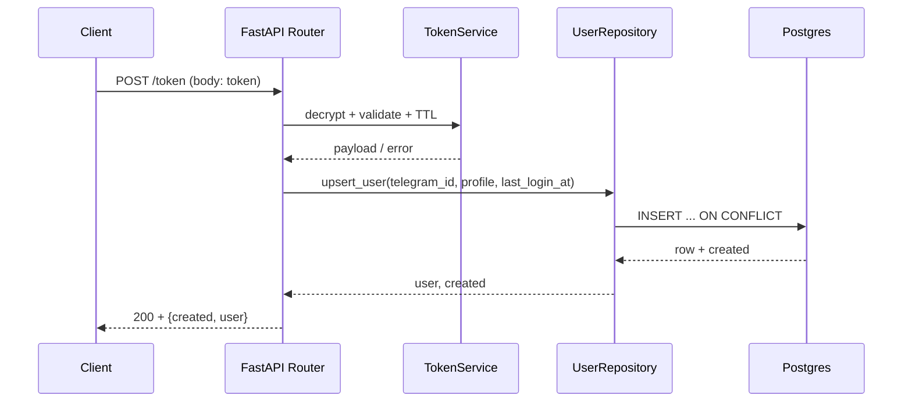

# Общая структура папок проекта

## Краткое описание

Этот документ описывает, **где что лежит в репозитории** и **куда добавлять новые файлы**. Он нужен, чтобы команда поддерживала единый порядок: код не складывался в `main.py`, миграции не терялись, а мок-данные не попадали в прод.

Здесь указано назначение основных папок и простые правила, которые помогают не “сломать” структуру проекта.

## Оглавление

- 1. Структура репозитория
- 2. Исходники приложения
- 3. База данных и миграции
- 4. Тесты и мок-данные
- 5. Скрипты для разработки
- 6. Документация
- 7. Правила и договорённости
- 8. Auth / Token
- 8.7 Auth / Session
- 8.8 Роли и пространства (Spaces)
- 9. Локальный mock oauth.name (Token Issuer)
- 10. Как тестировать функционал
---

## 1. Структура репозитория

Фактическая структура проекта:

```text
/
  app/                      # исходный код FastAPI приложения
  alembic/                  # миграции БД (Alembic)
  tests/                    # unit/integration тесты
  docs/                     # проектная документация
  mock_oauth/               # локальный mock oauth.name (dev/test-only)

  .env.example              # пример переменных окружения
  .gitignore
  .pre-commit-config.yaml   # pre-commit хуки
  alembic.ini               # конфиг Alembic
  docker-compose.yml
  docker-compose.mock.yml
  Dockerfile
  pyproject.toml            # настройки инструментов (ruff/formatters и т.п.)
  requirements.txt          # prod-зависимости
  requirements-dev.txt      # dev-зависимости
  README.md                 # как запустить проект
```

Что **не коммитим**:

- `.venv/` — локальное виртуальное окружение
- `.ruff_cache/` — кэш линтера

---

## 2. Исходники приложения (`app/`)

Папка `app/` — это Python-пакет с кодом бэкенда.

### 2.1 Текущая структура

```text
app/
  main.py                   # создание FastAPI приложения, подключение роутов
  db.py                     # создание пула asyncpg и зависимость для соединения
  models.py                 # SQLAlchemy модели
  api/                      # HTTP слой (эндпоинты и схемы)
    v1/
      routes/               # роутеры: auth.py, session.py
      schemas/              # Pydantic схемы запросов/ответов
  services/                 # бизнес-логика (token/session/auth)
  repositories/             # работа с БД (users, sessions)
  core/                     # конфиг, логирование, ошибки, trace_id
  clients/                  # клиенты внешних сервисов
  tests/                    # тесты для app (простые проверки)
```

### 2.2 Рекомендуемая структура для роста проекта

Если доменов станет больше, можно разнести `db.py/models.py` в подмодули:

```text
app/
  db/
    session.py              # engine + sessionmaker
    base.py                 # declarative Base
    models/                 # SQLAlchemy модели по файлам
```

Принцип простой:

- **Роуты** принимают запрос → вызывают **service** → service использует **repository/client** → возвращаем ответ.

Актуальная реализация (`/token`, `/session`) в коде:
- `app/api/v1/routes/auth.py` — HTTP endpoint `/token`.
- `app/api/v1/routes/session.py` — HTTP endpoints `/session*`.
- `app/api/v1/schemas/*.py` — Pydantic схемы.
- `app/services/token_service.py` — decrypt + TTL.
- `app/services/auth_service.py` — verify + upsert (+ логика первого superuser).
- `app/services/session_service.py` — stateful сессии.
- `app/repositories/users.py`, `app/repositories/sessions.py` — работа с БД.
- `app/core/errors.py`, `app/core/trace.py` — единый формат ошибок и `trace_id`.

OpenAPI доступен по `/docs`, enum кодов ошибок описан в схеме для генерации типов.

---

## 3. База данных и миграции (`alembic/`)

`alembic/` отвечает за версионирование схемы БД.

```text
alembic/
  env.py
  script.py.mako
  versions/                 # файлы миграций
alembic.ini
```

Правила:

- Любое изменение таблиц делаем **через новую миграцию** в `alembic/versions/`.
- Не правим схему БД вручную “в обход” миграций.

Текущие ключевые миграции:
- `0002_create_users_table`
- `0003_add_last_login_at`
- `0004_create_sessions_table`
- `0005_add_spaces_and_roles`

---

## 4. Тесты и мок-данные (`tests/`)

Текущая структура тестов:

```text
tests/
  unit/
  integration/
  conftest.py
```

Правила:

- Мок-данные для тестов при необходимости храним в `tests/fixtures/`.
- Тесты должны отражать контракт ошибок (400/401/500) и ключевые ветки логики.

---

## 5. Скрипты для разработки (`scripts/`)

Папка `scripts/` может использоваться для задач “один раз/иногда”. Сейчас в проекте отсутствует, но допустимо добавить:

```text
scripts/
  seed_dev.py               # наполнение dev БД данными
  backfill_*.py             # разовые миграции данных
  local_tools_*.py          # локальные проверки/утилиты
```

---

## 6. Документация (`docs/`)

Ключевые файлы документации:

- `docs/Формат ошибок.md` — source of truth по ошибкам.
- `docs/errors.md` — краткая выжимка для фронта.
- `docs/token-endpoint.md` — контракт и детали `/token`.
- `docs/session-endpoints.md` — контракт `/session*`.
- `docs/spaces-api-endpoints-and-logic.md` — контракт и логика `/spaces*`.
- `docs/Миграции.md` — схема БД и миграции.
- `docs/project-structure.md` — краткое описание структуры (отдельный файл).
- `docs/token-e2e-docker-test.md` — e2e проверка `/token` в Docker.

---

## 7. Правила и договорённости

1. **Не складываем всё в `main.py`.**
   `main.py` — это “сборка” приложения: подключение роутов, middleware, обработчики ошибок.

2. **Бизнес-логика живёт в `services/`.**
   Если логика не про HTTP (не про request/response) — ей место там.

3. **Доступ к БД через `repositories/`.**
   Роуты не должны содержать большие SQL-запросы.

4. **Миграции только через Alembic.**
   Любые изменения схемы — отдельной миграцией в `alembic/versions/`.

5. **Мок-данные и тестовые заготовки — только в `tests/fixtures/`.**
   Никаких “test_data.json” в корне или внутри `app/`.

6. **Документируем важные договорённости.**
   Формат ошибок, правила именования, структура — фиксируем в `docs/`, а не “в чате”.

---

## 8. Auth / Token

### 8.1 Назначение

Endpoint `POST /token` принимает encrypted access token от oauth.name в body JSON и:
- локально расшифровывает токен (AES-256-CBC + HMAC);
- валидирует payload (`telegram_id`, `username?`, `created_at`);
- проверяет TTL по `TOKEN_TTL_SECONDS`;
- делает upsert пользователя по `telegram_id`;
- возвращает `{ created, user }`.

Payload токена включает `username`, `telegram_id`, `first_name?`, `last_name?`, `photo_url?`, `created_at` (unix), `permission?`.

### 8.2 Поток данных



### 8.3 Контракт и ошибки (кратко)

- `200 OK` — пользователь создан/обновлён; возвращается `{ created, user }`.
- `400` — ошибка валидации запроса (`VALIDATION_ERROR`).
- `401` — токен невалиден/просрочен (`OAUTH_CODE_INVALID`).
- `500` — внутренняя ошибка/ошибка БД (`INTERNAL_ERROR`).

Пример успеха:
`{"created": true, "user": {"telegram_id": 123, "username": "user", "created_at": "...", "last_login_at": "..."}}`

Пример ошибки:
`{"status":"error","message":"OAUTH_CODE_INVALID","timestamp":"2025-01-01T12:00:00Z"}`

### 8.4 Где формируются коды и схемы

- Pydantic схемы: `app/api/v1/schemas/auth.py`.
- Формат ошибок и enum кодов: `app/core/errors.py`.
- `trace_id` формируется в middleware и возвращается в заголовке `X-Trace-Id`: `app/core/trace.py`, `app/main.py`.
- TokenService (decrypt + TTL): `app/services/token_service.py`.
- OpenAPI доступен по `/docs`; enum кодов ошибок нужен для генерации типов (openapi-typescript).

### 8.5 Практики

- Не логировать raw токен; в логах только `trace_id` и тип ошибки.
- `telegram_id` — основной внешний идентификатор пользователя.
- `last_login_at` обновляется при каждом успешном verify.
- TTL считается на стороне приложения по `created_at`.
- Ключ для AES/HMAC берётся из `sha256("{application_id}:{secret_key}")`.

### 8.6 Что изменено в рамках задачи

- Добавлен endpoint `POST /token` с обработкой 200/400/401/500.
- Реализован TokenService для decrypt + TTL (oauth.name алгоритм).
- Реализован upsert пользователя по `telegram_id` с `last_login_at`.
- Обновлён формат ошибок (`status/message/timestamp`).
- Добавлены unit/integration тесты для verify.
- Добавлен локальный mock oauth.name для генерации тестовых токенов.

### 8.7 Auth / Session (stateful)

Эндпойнты:
- `POST /session` — создать сессию после проверки oauth.name токена.
- `GET /session` — проверить текущую сессию.
- `POST /session/refresh` — продлить срок жизни.
- `DELETE /session` — отозвать сессию.

Передача session token:
- `Authorization: Bearer <session_token>`.
Session token — opaque; в БД хранится только `token_hash`. TTL задаётся через `SESSION_TTL_SECONDS`.

Поток:
1) `POST /session` принимает oauth token в теле.
2) TokenService проверяет токен, AuthService делает upsert пользователя.
3) SessionService создаёт запись в `sessions` (token хранится как hash).
4) Возвращается `{ authenticated, session_token, expires_at, user }`.

Ключевые файлы:
- `app/api/v1/routes/session.py` — HTTP слой.
- `app/api/v1/schemas/session.py` — схемы ответов.
- `app/services/session_service.py` — бизнес-логика.
- `app/repositories/sessions.py` — работа с БД.
- `alembic/versions/0004_create_sessions_table.py` — миграция.

### 8.8 Роли и пространства (Spaces)

Текущая реализация:

- Глобальная роль: `users.is_superuser` (не связана с oauth claim `permission`).
- Пространства: таблица `spaces` с soft delete (`deleted_at`, `delete_scheduled_at`).
- Роли внутри пространства: таблица `space_members` c `role` (`owner`/`admin`/`editor`/`viewer`).
- Первый залогиненный пользователь становится superuser, если в системе ещё нет `is_superuser=true`.
- Права на статьи наследуются от роли пространства (article-level override пока нет).

Контракт эндпойнтов `/spaces*` и правила доступа описаны в `docs/spaces-api-endpoints-and-logic.md`.

---

## 9. Локальный mock oauth.name (Token Issuer)

Mock используется только локально и не влияет на обычный запуск.

Запуск:

```bash
docker compose -f docker-compose.yml -f docker-compose.mock.yml up --build
```

Mock доступен по адресу:
- `http://localhost:9001/oauth/token/issue` — выдача токена по payload.
- `http://localhost:9001/oauth/token/examples` — готовые кейсы:
  - `valid`, `expired`, `invalid`
  - `invalid_hmac`, `invalid_base64`
  - `missing_fields`, `wrong_types`

Mock использует те же `OAUTH_NAME_APPLICATION_ID`, `OAUTH_NAME_SECRET_KEY`, `TOKEN_TTL_SECONDS`.
Для детерминированных токенов можно задать `OAUTH_MOCK_FIXED_CREATED_AT`.

---

## 10. Как тестировать функционал

1) Запуск сервисов:

```bash
docker compose -f docker-compose.yml -f docker-compose.mock.yml up --build
```

2) Получить тестовый токен:

```bash
curl http://localhost:9001/oauth/token/examples
```

3) Проверка endpoint:

```bash
curl -X POST http://localhost:8000/token \
  -H "Content-Type: application/json" \
  -d '{"token":"<valid_token>"}'
```

4) Проверка сессии:
```bash
curl -X POST http://localhost:8000/session \
  -H "Content-Type: application/json" \
  -d '{"token":"<valid_token>"}'
```
Из ответа взять `session_token` и вызвать:
```bash
curl http://localhost:8000/session \
  -H "Authorization: Bearer <session_token>"
```

```bash
curl -X POST http://localhost:8000/token \
  -H "Content-Type: application/json" \
  -d '{"token":"<expired_token>"}'
```

```bash
curl -X POST http://localhost:8000/token \
  -H "Content-Type: application/json" \
  -d '{"token":"invalid-token"}'
```
